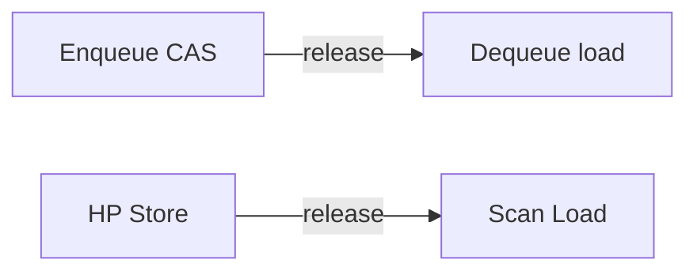
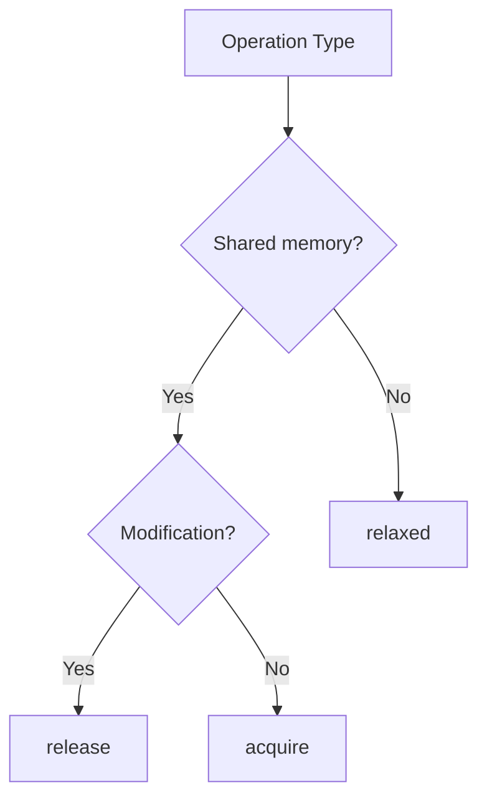
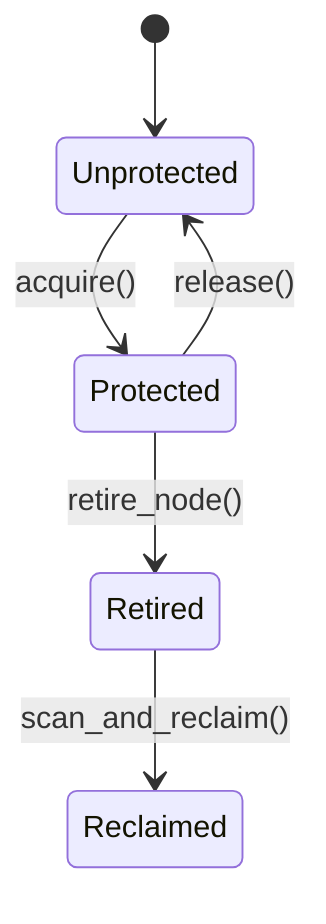

# Phase 1: SPECIFICATION

## Task 1.1: Michael & Scott Queue Algorithm Specification

### 1.1.1 Research Fundamentals
- Original paper: "Simple, Fast, and Practical Non-Blocking and Blocking Concurrent Queue Algorithms" by Maged M. Michael and Michael L. Scott
- Core principles:
  - Lock-free synchronization using CAS operations
  - Dummy node to handle empty queue edge cases
  - Helping mechanism for concurrent enqueue/dequeue operations

### 1.1.2 Node Structure
```cpp
struct Node {
    T data;
    std::atomic<Node*> next;
    // ABA counter will be integrated via pointer packing
};
```

### 1.1.3 Enqueue Operation
1. Create new node with data
2. CAS tail->next from null to new node
3. If CAS fails, help complete pending operations
4. Update tail pointer (can lag behind)

### 1.1.4 Dequeue Operation
1. Check if queue is empty (head == tail)
2. CAS head to next node
3. If CAS fails, retry or help complete
4. Extract data from dummy node's successor

### 1.1.5 Queue Invariants
1. Tail always points to last or second-to-last node
2. Head always points to first dummy node
3. Next pointer of last node is always null
4. All live nodes are reachable from head

### 1.1.6 Helping Mechanism
- When thread A fails CAS:
  - Checks if another thread needs help
  - Completes pending enqueue/dequeue
  - Then retries own operation
- Ensures lock-free progress

### 1.1.7 State Transitions
```mermaid
stateDiagram-v2
    [*] --> Empty
## Task 1.2: Hazard Pointer Specification

### 1.2.1 Hazard Pointer Fundamentals
- Based on Maged Michael's paper: "Hazard Pointers: Safe Memory Reclamation for Lock-Free Objects"
- Key concepts:
  - Per-thread pointers protecting accessed memory
  - Retired list for deferred reclamation
  - Scan phase to identify non-hazardous nodes

### 1.2.2 HP Array Structure
```cpp
constexpr int K = 2; // HPs per thread
constexpr int R = 2 * K; // Retire threshold

struct HazardPointer {
    std::atomic<void*> ptr;
    char padding[64 - sizeof(std::atomic<void*>)]; // Cache line padding
};

thread_local HazardPointer hp_array[K];
```

### 1.2.3 Acquire/Protect Protocol
1. Load protected pointer
2. Store pointer in HP slot
3. Verify pointer hasn't changed (double-check)
4. If changed, retry from step 1

### 1.2.4 Release Protocol
1. Set HP slot to nullptr
2. No memory barrier required (release not critical path)

### 1.2.5 Retire List Management
```cpp
thread_local std::vector<Node*> retire_list;

void retire_node(Node* node) {
    retire_list.push_back(node);
    if (retire_list.size() >= R) {
        scan_and_reclaim();
    }
}
```

### 1.2.6 Scan and Reclaim Algorithm
1. Collect all hazard pointers system-wide
2. Identify non-hazardous nodes in retire list
3. Reclaim memory for non-hazardous nodes
4. Keep hazardous nodes for next scan

## Task 1.3: Memory Ordering Specification

### 1.3.1 C++ Memory Model
- Sequential Consistency (seq_cst): Strongest ordering
- Acquire-Release (acquire, release, acq_rel)
- Relaxed (relaxed): No ordering guarantees

### 1.3.2 Queue Operation Ordering
| Operation         | Memory Order           | Rationale |
|-------------------|------------------------|-----------|
| tail->next CAS    | release                | Make new node visible after CAS |
| head load         | acquire                | See all previous enqueues |
| tail update       | relaxed                | Eventually consistent |
| helping CAS       | acq_rel                | Full barrier for helping |

### 1.3.3 Hazard Pointer Ordering
| Operation         | Memory Order           | Rationale |
|-------------------|------------------------|-----------|
| HP store          | release                | Make protected ptr visible |
| HP load           | acquire                | See latest protected ptrs |
| Retire list       | relaxed                | Thread-local only |

### 1.3.4 Synchronization Pairs
1. Enqueue CAS (release) - Dequeue load (acquire)
2. HP store (release) - Scan load (acquire)
3. Helping CAS (acq_rel) - All subsequent operations

### 1.3.5 Acquire-Release Relationships


### 1.3.6 Memory Order Selection


### 1.3.7 Incorrect Ordering Risks
- Data races
- Stale reads
- Lost updates
- Infinite loops
- Memory corruption

### 1.3.8 Research Paper Reference
- Follows Table 1 from "Memory Models for C/C++ Programmers"

## Task 1.4: Error Handling Specification

### 1.4.1 Allocation Failures
- Use std::nothrow for node allocation
- Return error codes instead of exceptions
- Queue remains consistent after failure

### 1.4.2 Invariant Violation
- Use assert() in debug builds
- Return QUEUE_CORRUPTED error in production
- Log detailed error state

### 1.4.3 Exception Safety
- Basic guarantee: Queue remains usable
- No-throw guarantee for all atomic operations
- Strong guarantee for non-concurrent operations

### 1.4.4 Recovery Strategies
| Error Type        | Recovery Action               |
|-------------------|-------------------------------|
| Allocation fail   | Return OUT_OF_MEMORY          |
| Invariant broken  | Shutdown queue gracefully     |
| Memory corruption | Abort process with core dump  |

### 1.4.5 Debugging Hooks
- Optional logging of all operations
- Statistics counters (enqueues/dequeues)
- Deadlock detection heuristics
- Memory leak tracking
### 1.2.7 HP-Thread Association
- Thread-local storage for HP arrays
- Global registry of all HP arrays
- Lock-free linked list for registry updates

### 1.2.8 State Machine


### 1.2.9 HP Array Sizing
- Static sizing: Fixed K per thread
- Dynamic sizing: Adapt based on contention
- Default: K=2 (sufficient for queue operations)

// Memory Ordering and Error Handling sections to follow
    Empty --> Enqueuing : enqueue()
    Enqueuing --> NonEmpty : CAS success
    NonEmpty --> Enqueuing : enqueue()
    NonEmpty --> Dequeuing : dequeue()
    Dequeuing --> NonEmpty : CAS success
    Dequeuing --> Empty : last element removed
```

### 1.1.8 Dummy Node Lifecycle
1. Created during queue initialization
2. Remains until queue destruction
3. Serves as sentinel for empty queue
4. Never contains user data

// Additional sections for Tasks 1.2-1.4 will be added in subsequent iterations